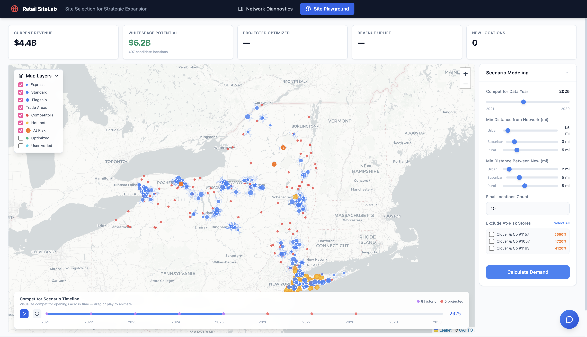
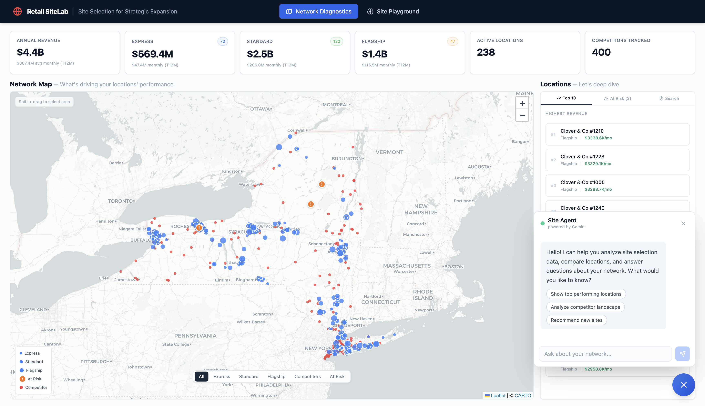
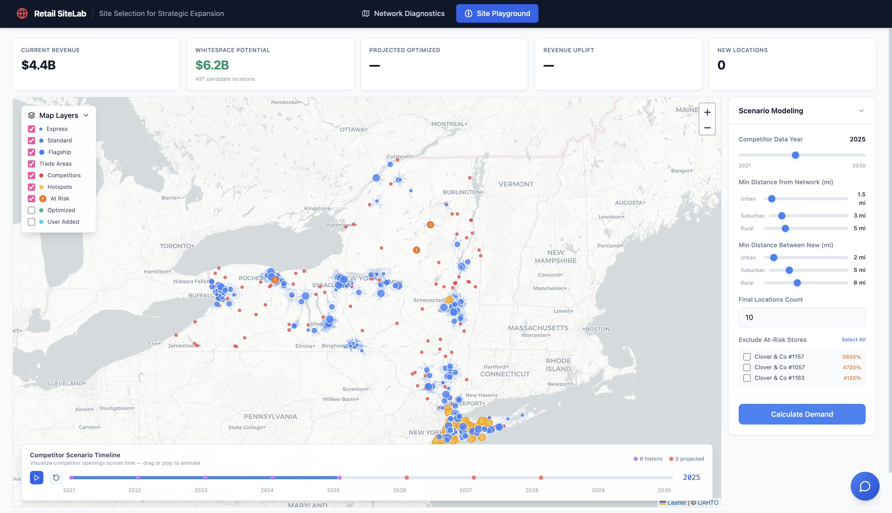

# Retail SiteLab

**Where should we open the next store?** Traditional site selection relies on gut instinct, spreadsheets, and manual market research — a process that takes months per location and still gets it wrong 30% of the time. This platform combines geospatial analytics, ML-driven revenue prediction, and scenario modeling into a single interactive tool. Retailers using data-driven site selection expand 3-5x faster with higher success rates, and this accelerator proves it's possible with open-source data and Databricks.

The entire pipeline — from Census data ingestion to H3 hexagonal analysis to XGBoost revenue prediction — runs on Databricks with Unity Catalog governance. The app itself is a full-stack Databricks App with a FastAPI backend and React frontend, deployed via Databricks Asset Bundles.

## Demo


---

## Architecture



### Stack

| Layer | Technology |
|-------|-----------|
| **Data Platform** | Databricks Unity Catalog, Serverless SQL Warehouses |
| **Pipeline** | Medallion Architecture (Bronze → Silver → Gold), PySpark notebooks |
| **ML** | XGBoost revenue model, MLflow tracking, UC Model Registry |
| **Geospatial** | H3 hexagons (res 8), Valhalla isochrones, Haversine distance |
| **Backend** | FastAPI, Databricks SDK (`WorkspaceClient`), SQL Statement Execution API |
| **Frontend** | React 18, TypeScript, Vite, TanStack Router, Leaflet maps, Recharts, Tailwind CSS |
| **LLM** | Gemini 2.5 Flash via Databricks Foundation Model API |
| **Deployment** | Databricks Apps, Databricks Asset Bundles (DABs) |

### App Screenshots

| Network Diagnostics | Site Playground |
|---|---|
|  |  |

### Key Features

- **Network Diagnostics** — Interactive map with H3 trade area analysis, store performance metrics, at-risk detection
- **Site Playground** — Scenario modeling with a greedy optimizer: add/remove locations, tune per-urbanicity distance constraints, compare scenarios side-by-side
- **AI Site Agent** — Natural language Q&A about the store network powered by Gemini 2.5 Flash
- **Revenue Prediction** — XGBoost model predicting $/sqft across 3 store formats (express/standard/flagship), capturing format-market fit dynamics
- **Competitor Simulation** — Projected competitor growth (2026–2028) with brand-specific expansion rates

---

## Installation

### Prerequisites

- A Databricks workspace with Unity Catalog enabled
- Databricks CLI installed and configured (`databricks auth profiles`)
- Python 3.11+ (managed via `uv`)
- Node.js 18+ and npm
- A Serverless SQL Warehouse

### 1. Clone the repo

```bash
git clone https://github.com/samyuktha17/geospatial-retail-site-selection.git
cd geospatial-retail-site-selection
```

### 2. Configure Databricks

Update `databricks.yml` with your workspace profile:

```yaml
targets:
  dev:
    default: true
    mode: development
    workspace:
      profile: YOUR_PROFILE
```

Update `app/app.yaml` with your warehouse and catalog:

```yaml
env:
  - name: DATABRICKS_WAREHOUSE_ID
    value: "your-warehouse-id"
  - name: DATABRICKS_CATALOG
    value: "your_catalog"
  - name: DATABRICKS_SCHEMA
    value: "your_schema"
```

### 3. Run the data pipeline

Upload the notebooks in `pipelines/` to your Databricks workspace and run them in order:

1. **Bronze** — Ingest Census demographics, OSM POIs, store/competitor locations, seed points
2. **Silver** — Clean POIs, compute H3 features, generate isochrones via Valhalla API
3. **Gold** — Aggregate trade area features, generate sales, train XGBoost model, score expansion candidates

Each notebook accepts `catalog` and `schema` as widget parameters. Set these to your Unity Catalog location.

### 4. Build and deploy the app

```bash
# Install frontend dependencies and build
cd app/ui
npm install
npm run build
cd ../..

# Deploy with Databricks Asset Bundles
databricks bundle deploy --target dev

# Restart the app to pick up new code
databricks apps stop site-selection-dev --no-wait
sleep 10
databricks apps start site-selection-dev --no-wait
```

### 5. Run locally (optional)

The app works locally in synthetic mode (no Databricks connection needed):

```bash
# Backend
cd app
pip install -r requirements.txt
uvicorn backend.main:app --reload --port 8000

# Frontend (separate terminal)
cd app/ui
npm install
npm run dev
```

Set `DATABRICKS_PROFILE=YOUR_PROFILE` to connect to a live workspace instead.

---

## Project Structure

```
├── databricks.yml                  # DABs bundle configuration
├── resources/
│   └── site_selection_app.app.yml  # Databricks App resource
├── pipelines/
│   ├── bronze/                     # Raw data ingestion (Census, OSM, stores)
│   ├── silver/                     # H3 features, isochrones, cleaned data
│   └── gold/                       # ML model, scoring, competitor simulation
└── app/
    ├── app.yaml                    # App entrypoint config
    ├── backend/                    # FastAPI backend
    │   ├── main.py                 # App entry, mounts API + SPA
    │   ├── router.py               # API endpoints + greedy optimizer
    │   └── data/
    │       ├── store.py            # Hybrid data store (SQL or synthetic)
    │       ├── sql_client.py       # Databricks SQL execution + caching
    │       ├── fetchers.py         # SQL queries for each data domain
    │       └── gemini_chat.py      # LLM chat via Foundation Model API
    └── ui/                         # React frontend
        └── src/
            ├── routes/             # TanStack Router pages
            ├── components/         # Maps, panels, shared components
            └── lib/                # API client, utilities
```
