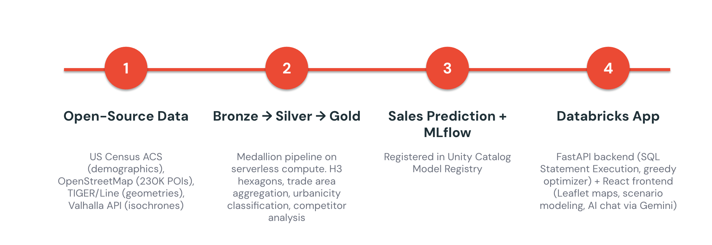
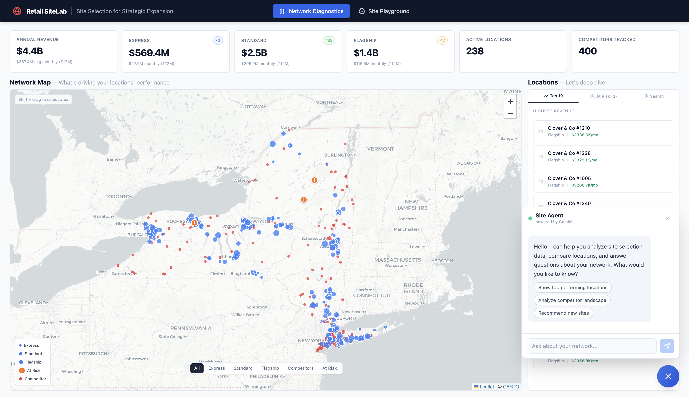
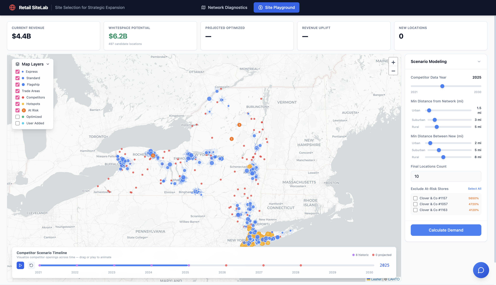

# Retail SiteLab

**Where should we open the next store?** Traditional site selection relies on gut instinct, spreadsheets, and manual market research - a process that takes months per location and still gets it wrong 30% of the time. This platform combines geospatial analytics, ML-driven revenue prediction, and scenario modeling into a single interactive tool. Retailers using data-driven site selection expand 3-5x faster with higher success rates, and this accelerator proves it's possible with open-source data and Databricks.

The entire pipeline - from Census data ingestion to H3 hexagonal analysis to XGBoost revenue prediction - runs on Databricks with Unity Catalog governance. The app itself is a full-stack Databricks App with a FastAPI backend and React frontend, deployed via Databricks Asset Bundles.

> [!IMPORTANT]
> **Sample app out of the box, full experience after setup.** If you deploy this
> without configuring anything, the app runs as a **self-contained sample** on
> **synthetic data** — the maps, hexes, and store network are illustrative only, and
> the AI features (Site Agent, Genie Q&A) will not work. To get the **full
> experience with real data**, you must complete the [configuration](#2-configure-databricks)
> (SQL Warehouse, Unity Catalog, Genie Space, and Foundation Model endpoints) **and**
> [run the data pipelines](#3-run-the-data-pipeline).

---



### Stack

| Layer | Technology |
|-------|-----------|
| **Data Platform** | Databricks Unity Catalog, Serverless SQL Warehouses |
| **Pipeline** | Medallion Architecture (Bronze → Silver → Gold), PySpark notebooks |
| **ML** | XGBoost revenue model, MLflow tracking, UC Model Registry |
| **Geospatial** | H3 hexagons (res 8), Valhalla isochrones, Haversine distance |
| **Backend** | FastAPI, Databricks SDK (`WorkspaceClient`), SQL Statement Execution API |
| **Frontend** | React 18, TypeScript, Vite, TanStack Router, Leaflet maps, Recharts, Tailwind CSS |
| **LLM** | Gemini 2.5 Flash via Databricks Foundation Model API |
| **Deployment** | Databricks Apps, Databricks Asset Bundles (DABs) |


| Network Diagnostics | Site Playground |
|---|---|
|  |  |

### Key Features

- **Network Diagnostics** - Interactive map with H3 trade area analysis, store performance metrics, at-risk detection
- **Site Playground** - Scenario modeling with a greedy optimizer: add/remove locations, tune per-urbanicity distance constraints, compare scenarios side-by-side
- **AI Site Agent** - Natural language Q&A about the store network powered by Gemini 2.5 Flash
- **Revenue Prediction** - XGBoost model predicting $/sqft across 3 store formats (express/standard/flagship), capturing format-market fit dynamics
- **Competitor Simulation** - Projected competitor growth (2026-2028) with brand-specific expansion rates

---

## Installation

### Prerequisites

- A Databricks workspace with Unity Catalog enabled
- Databricks CLI installed and configured (`databricks auth profiles`)
- Python 3.11+ (managed via `uv`)
- Node.js 18+ and npm
- A Serverless SQL Warehouse

### 1. Clone the repo

```bash
git clone https://github.com/samyuktha17/geospatial-retail-site-selection.git
cd geospatial-retail-site-selection
```

### 2. Configure Databricks

There are two bundles to update: `databricks.yml` (the app) and `pipelines/databricks.yml`
(the data pipeline). Replace every `YOUR_*` placeholder with your own values.

> **Which file holds the app config?** When you **deploy with Asset Bundles**
> (the normal path, §4), the app's environment is built from the `dev` target
> variables in **`databricks.yml`** — `app/app.yaml` is used only when you [run
> locally](#5-run-locally-optional). So set the values below in `databricks.yml`,
> not `app/app.yaml`.

**`databricks.yml`** (app bundle) — set your CLI profile and the `dev` target variables:

```yaml
targets:
  dev:
    default: true
    mode: development
    workspace:
      profile: YOUR_PROFILE                 # ← databricks auth profiles
    variables:
      warehouse_id: "YOUR_WAREHOUSE_ID"     # ← from the SQL Warehouses page
      catalog: "YOUR_CATALOG"               # ← Unity Catalog name
      schema: "YOUR_SCHEMA"                 # ← schema to create tables in
      genie_space_id: "YOUR_GENIE_SPACE_ID" # ← see "Genie Space" below
```

**`pipelines/databricks.yml`** (pipeline bundle) — set your CLI profile, catalog, schema, and Census API key:

```yaml
targets:
  dev:
    workspace:
      profile: YOUR_PROFILE       # ← databricks auth profiles
    variables:
      catalog: your_catalog       # ← Unity Catalog name
      schema: your_schema         # ← schema to create tables in
      census_api_key: "abc123"    # ← free at api.census.gov/data/key_signup.html
      cluster_id: "xxxx-xxxxxx"   # ← cluster with GDAL/pyosmium (for 2 bronze tasks)
```

#### Genie Space (required for the AI Site Agent)

The AI Site Agent and natural-language Q&A are powered by a
[Genie Space](https://docs.databricks.com/en/genie/index.html). Create one over your
catalog/schema, then copy its **Space ID** (the last path segment of the Genie Space
URL) into `genie_space_id` above. Without it, the map and analytics still work, but
the AI features will not.

#### Foundation Model endpoints (required for the AI features)

The app calls two Databricks Foundation Model API endpoints, configured in
`resources/site_selection_app.app.yml`:

| Env var | Default endpoint | Used for |
|---------|------------------|----------|
| `SERVING_ENDPOINT` | `databricks-claude-sonnet-4-6` | Site Agent reasoning |
| `CHAT_ENDPOINT` | `databricks-gemini-2-5-flash` | Chat responses |

These pay-per-token endpoints must exist and be enabled in your workspace/region.
Check under **Serving → Endpoints**; if yours have different names (or your region
offers different models), update the two `value:` fields in
`resources/site_selection_app.app.yml` to match.

### 3. Run the data pipeline

> **Note:** Without the pipeline, the app runs as a **sample on synthetic data** (see
> the callout at the top). Run these pipelines to populate your catalog with **real
> data** and get the full experience.

**Prerequisites:**
- Create a catalog and schema in Unity Catalog: `CREATE CATALOG my_catalog; USE CATALOG my_catalog; CREATE SCHEMA my_schema;`
- Get a free Census API key at [api.census.gov/data/key_signup.html](https://api.census.gov/data/key_signup.html)

Clone the repo as a **Git folder** in your Databricks workspace (Workspace → Git folders → Add Git folder). Every notebook takes `catalog` and `schema` as widget parameters. All other parameters default to New York State.

**Run in this order:**

**Step 1 - Exploration** (synthetic store/competitor data - run these first):
1. `pipelines/exploration/generate_store_locations.py` - ~238 store locations across NY
2. `pipelines/exploration/generate_competitor_locations.py` - ~400 competitor locations
3. `pipelines/exploration/generate_seed_points.py` - Expansion candidate seed points

**Step 2 - Bronze** (raw ingestion from external APIs):
1. `pipelines/bronze/census_demographics.py` - Census ACS demographics (needs `census_api_key`)
2. `pipelines/bronze/census_boundaries.py` - TIGER/Line block group boundaries
3. `pipelines/bronze/osm_download.py` - OpenStreetMap data from Geofabrik
4. `pipelines/bronze/extract_pois.py` - Points of Interest from OSM

**Step 3 - Silver** (cleaning & feature engineering):
1. `pipelines/silver/clean_census_demographics.py` - Clean and derive rates
2. `pipelines/silver/census_zcta.py` - ZCTA boundaries + demographics (needs `census_api_key`)
3. `pipelines/silver/clean_pois.py` - Filter and structure POIs
4. `pipelines/silver/create_h3_features.py` - H3 hex features (demographics, POIs, competitors)
5. `pipelines/silver/generate_seed_points.py` - Score and filter expansion candidates
6. `pipelines/silver/create_isochrones_valhalla.py` - Drive-time trade area polygons (calls Valhalla public API)

**Step 4 - Gold** (ML & scoring):
1. `pipelines/gold/aggregate_trade_area_features.py` - Aggregate features within store trade areas
2. `pipelines/gold/generate_store_sales.py` - Revenue per sqft model
3. `pipelines/gold/train_sales_model.py` - Train XGBoost, log to MLflow
4. `pipelines/gold/aggregate_seed_trade_area_features.py` - Aggregate features for seed points
5. `pipelines/gold/predict_seed_sales.py` - Score seed points with trained model
6. `pipelines/gold/simulate_competitor_growth.py` - Project competitor expansion (2026-2028)

### 4. Build and deploy the app

```bash
# Install frontend dependencies and build
cd app/ui
npm install --legacy-peer-deps
npm run build
cd ../..

# Deploy with Databricks Asset Bundles
databricks bundle deploy --target dev

# Restart the app to pick up new code
databricks apps stop site-selection-dev --no-wait
sleep 15
databricks apps start site-selection-dev --no-wait
```

### 5. Run locally (optional)

The app works locally in synthetic mode (no Databricks connection needed). Requires [uv](https://docs.astral.sh/uv/) for Python dependency management:

```bash
# Backend
cd app
uv run uvicorn backend.main:app --reload --port 8000

# Frontend (separate terminal)
cd app/ui
npm install --legacy-peer-deps
npm run dev
```

Set `DATABRICKS_PROFILE=YOUR_PROFILE` to connect to a live workspace instead.

---

## Project Structure

```
├── .claude/
│   └── skills/
│       └── geospatial-databricks/  # Reusable geospatial-on-Databricks patterns (see below)
├── databricks.yml                  # DABs bundle config (app deployment)
├── resources/
│   └── site_selection_app.app.yml  # Databricks App resource
├── pipelines/
│   ├── databricks.yml              # DABs bundle config (pipeline jobs)
│   ├── resources/
│   │   ├── configs/                # YAML configs (isochrone, H3, POI, census)
│   │   └── jobs/                   # Job definitions (bronze, silver, gold)
│   ├── bronze/                     # Raw data ingestion (Census, OSM, stores)
│   ├── silver/                     # H3 features, isochrones, cleaned data
│   ├── gold/                       # ML model, scoring, competitor simulation
│   └── exploration/                # Synthetic data generators (stores, competitors)
└── app/
    ├── app.yaml                    # App entrypoint config
    ├── backend/                    # FastAPI backend
    │   ├── main.py                 # App entry, mounts API + SPA
    │   ├── router.py               # API endpoints + greedy optimizer
    │   └── data/
    │       ├── store.py            # Hybrid data store (SQL or synthetic)
    │       ├── sql_client.py       # Databricks SQL execution + caching
    │       ├── fetchers.py         # SQL queries for each data domain
    │       └── gemini_chat.py      # LLM chat via Foundation Model API
    └── ui/                         # React frontend
        └── src/
            ├── routes/             # TanStack Router pages
            ├── components/         # Maps, panels, shared components
            └── lib/                # API client, utilities
```

---

## Geospatial patterns (Claude Code skill)

The hard-won geospatial lessons from building this pipeline are captured as a
[Claude Code skill](.claude/skills/geospatial-databricks/SKILL.md) so they can be
reused on other Databricks spatial work. It auto-loads when you work in this repo
(or invoke `/geospatial-databricks`), and covers both the general principles of
scalable spatial analysis and their Databricks specifics:

- **Spatial joins** — making the indexed `PhotonShuffledSpatialJoin` (SSJ) fire
  instead of a brute-force N×M join (DBR 18.x, dropping `BROADCAST`, the
  equi-key/CTE gotcha), plus the Sedona fallback and planar vs WGS84 coordinates
- **H3 indexing** — grid generation, H3-as-join-key, resolution selection,
  point-in-polygon, area-weighted interpolation, and k-ring distance features
- **Gotchas** — SRID 4326, `ST_Area` units, serverless geometry-collection crashes,
  census null sentinels/top-coding, OSM PBF batched extraction, isochrone retries
- **Inline visualization** — converting geometry/H3 for pydeck/folium in notebooks

References live alongside it: `references/sql-function-reference.md` (ST_*/h3_*
cheat sheet + SSJ plan-reading) and `references/ingestion-pipelines.md`
(census/OSM/Valhalla ingestion + the GeoPandas↔Spark bridge).

---

## 📜 License

Licensed under the Apache License, Version 2.0. See [LICENSE](LICENSE).

## 🆘 Support

This project is provided for exploration and demonstration only. It is not
formally supported by Databricks under any Service Level Agreement (SLA), is
provided AS-IS, and carries no guarantees of any kind. Please do not file a
Databricks support ticket for issues arising from its use. Any issues discovered
should be filed as GitHub Issues on this repository; they will be reviewed as
time permits, but there are no formal SLAs for support.

© 2026 Databricks, Inc. All rights reserved.
